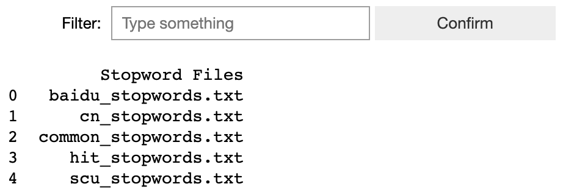
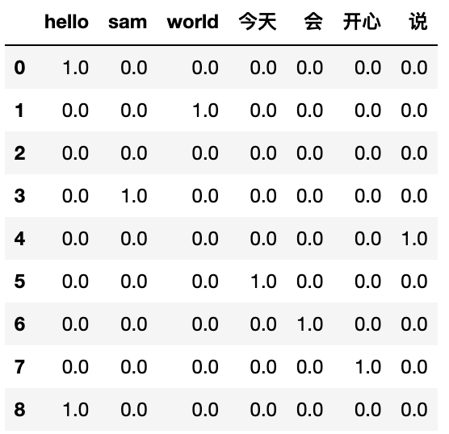
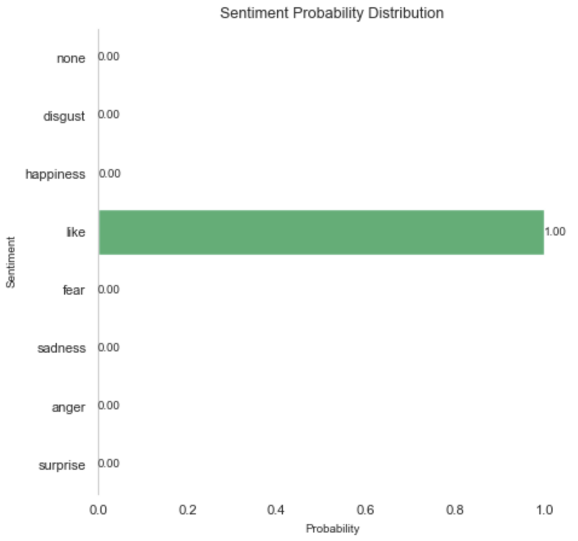

# HanziNLP

一个**用户友好**且**易于使用**的自然语言处理包，专为中文文本分析、建模和可视化而设计。HanziNLP中的所有功能都支持中文文本，并且非常适用于中文文本分析！

如果HanziNLP能够帮到你，非常希望能够请你给本repository点上🌟！

<details>
<summary>🇨🇳 Chinese Version (点击查看中文版本,由GPT-4翻译完成)</summary>
  
## 目录
- [1. 快速开始](#1-快速开始)
  - [1.1 相关链接](#11-相关链接)
  - [1.2 安装与使用](#12-安装与使用)
  - [1.3 交互式仪表板](#13-交互式仪表板)
- [2. 字符和词汇计数](#2-字符和词汇计数)
- [3. 字体管理](#3-字体管理)
- [4. 文本分段](#4-文本分段)
  - [4.1 停用词管理](#41-停用词管理)
  - [4.2 句子分段](#42-句子分段)
  - [4.3 词语标记](#43-词语标记)
- [5. 文本表示](#5-文本表示)
  - [5.1 词袋模型 (BoW)](#51-词袋模型-bow)
  - [5.2 ngrams](#52-ngrams)
  - [5.3 TF_IDF (词频-逆文档频率)](#53-tf_idf-词频-逆文档频率)
  - [5.4 TT_matrix (词-词矩阵)](#54-tt_matrix-词-词矩阵)
- [6. 文本相似性](#6-文本相似性)
- [7. 词嵌入](#7-词嵌入)
  - [7.1 Word2Vec](#71-word2vec)
  - [7.2 BERT 嵌入](#72-bert-嵌入)
- [8. 主题建模](#8-主题建模)
  - [8.1 潜在狄利克雷分配 (LDA) 模型](#81-潜在狄利克雷分配-lda-模型)
  - [8.2 LDA print_topics 函数](#82-lda-print_topics-函数)
- [9. 情感分析](#9-情感分析)
- [在您的研究中引用HanziNLP](#在您的研究中引用HanziNLP)

## 开发者备注：

对于任何使用HanziNLP的人,开发者向您表示衷心的感谢！🎉🎉🎉

关于我更多的信息和任何改进的建议，您可以通过以下方式找到我：
- **个人邮箱**：samzshi@sina.com
- **个人网站**：[https://www.samzshi.com/](https://www.samzshi.com/)
- **领英**：[www.linkedin.com/in/zhanshisamuel](www.linkedin.com/in/zhanshisamuel)

## 1. 快速开始

欢迎来到 **HanziNLP** 🌟 - 一个即用的中文文本自然语言处理（NLP）工具包，同时也支持英文。它旨在成为即便是Python新手也能友好使用的简化工具。

此外，HanziNLP还提供了一个交互式仪表板，用于动态洞察NLP功能，为各种NLP功能提供动态概览和洞察。

### 1.1 相关链接

- **GitHub仓库**：在[GitHub](https://github.com/samzshi0529/HanziNLP)上探索我的代码并做出贡献。
- **PyPI页面**：在[PyPI](https://libraries.io/pypi/HanziNLP)上找到我，并探索更多关于如何将HanziNLP集成到您的项目中的信息。

### 1.2 安装与使用

使用HanziNLP只需执行一个简单的命令即可开始！

```python
pip install HanziNLP
```

### 1.3 交互式仪表板


#### 通过一行简单的代码使用 dashboard()！

```python
from HanziNLP import dashboard
dashboard()
```

- **函数**：`dashboard()`
- **目的**：展示一个用户友好的仪表板，便于进行交互式文本分析和情感分类，使用户能够观察各种预训练模型和分词参数对处理文本的影响，从而选择最适合他们用例的模型和参数。
- **参数**：不需要参数。
- **返回**：无返回值；该函数输出一个仪表板界面。

#### 概述

`dashboard` 函数引入了一个用户交互式的仪表板，旨在执行文本分析和情感分类，为用户提供亲身体验，以探索和理解不同预训练模型和分词参数对文本处理的影响。

- **交互式文本分析**：用户可以输入文本，观察各种文本统计信息，例如单词计数、字符计数和句子计数，并可视化词频和情感分类结果。
- **模型探索**：用户可以选择从 Hugging Face 指定一个分类模型。如果留空，则使用默认模型 'uer/roberta-base-finetuned-chinanews-chinese'。有关此模型的更多信息，请访问 [Hugging Face](https://huggingface.co/uer/roberta-base-finetuned-chinanews-chinese)。
- **分词参数调整**：用户可以调整分词设置，例如 'Jieba Mode' 参数和停用词选择，并观察生成的词语及其各自的频率。
- **可视化**：仪表板提供了文本统计、词频和情感分类的视觉洞察，帮助用户理解文本分析结果。
- **情感分类**：仪表板使用指定的（或默认的）模型执行情感分类，并显示情感标签的概率分布。

#### 亮点

`dashboard` 函数强调**用户参与**和**探索**。它允许用户与各种预训练模型和分词参数进行交互式交流，观察它们对文本分析和情感分类的影响。这种交互式探索使用户能够做出明智的决策，选择最符合他们特定用例的模型和参数，从而增强他们的文本分析和自然语言处理（NLP）任务。

## 2. 字符和词汇计数

🚀 这个基本功能计算文本中的字符和单词数量，省去了您自己识别和分割中文单词的手动努力。

### char_freq 和 word_freq 函数
- `char_freq(text, text_only=True)`: 函数用于计算给定文本中每个字符的频率；如果 text_only == True，只会计算中文和英文字符。如果 text_only == False，将计算所有字符。默认为 True。
- `word_freq(text)`: 函数用于计算给定文本中每个单词的频率。
### 示例
```python
from HanziNLP import char_freq, word_freq

text = "你好, 世界!"
char_count = char_freq(text)
word_count = word_freq(text)

print(f"字符计数: {char_count}")
print(f"单词计数: {word_count}")
```
### 输出 
```python
字符计数: 4
单词计数: 2
```
## 3. 字体管理

在Python环境中可视化中文文本时，字体是一个经常需要手动导入的重要资源。HanziNLP内置了字体列表，可立即使用。您可以使用`list_fonts()`查看和过滤所有可用的字体，并使用`get_font()`检索用于可视化目的的特定字体路径。所有内置的字体都来自Google字体，它们根据开放字体许可证获得许可，这意味着您可以在产品和项目中使用它们——无论是印刷品还是数字品，无论是商业的还是其他的。

### list_fonts 和 get_font 函数
- `list_fonts()`: 列出所有可用的字体。
- `get_font(font_name, show=True)`: 检索用于可视化目的的特定字体。如果 show == True，将显示字体的样本可视化。如果 show == False，将不显示任何内容。默认设置为True。

#### list_fonts() 示例
```python
from HanziNLP import list_fonts

# 列出所有可用的字体
list_fonts()
```
#### 输出
.png)

#### get_font() 示例
```python
from HanziNLP import get_font

font_path = get_font('ZCOOLXiaoWei-Regular') #在 list_fonts() 中输入您喜欢的 font_name
```
#### 输出


#### 词云示例
您可以使用定义的中文 font_path 制作各种图表。下面提供了一个词云示例：
```python
from PIL import Image
from wordcloud import WordCloud,ImageColorGenerator
import matplotlib.pyplot as plt

# 由GPT-4生成的样本文本
text = '在明媚的春天里，小花猫咪悠闲地躺在窗台上，享受着温暖的阳光。她的眼睛闪烁着好奇的光芒，时不时地观察着窗外忙碌的小鸟和蝴蝶。小猫的尾巴轻轻摇动，表达着她内心的舒适和满足。在她的身边，一盆盛开的紫罗兰散发着淡淡的香气，给这个宁静的午后增添了几分诗意。小花猫咪偶尔会闭上她的眼睛，沉浸在这美好的时光中，仿佛整个世界都变得温馨和谐。窗外的樱花树在微风中轻轻摇曳，洒下一片片粉色的花瓣，如梦如幻。在这样的一个悠托的春日里，一切都显得如此美好和平静。'

text = " ".join(text)

# 生成词云
wordcloud = WordCloud(font_path= font_path, width=800, height=800,
                      background_color='white',
                      min_font_size=10).generate(text)

# 显示词云
plt.figure(figsize=(5, 5), facecolor=None)
plt.imshow(wordcloud)
plt.axis("off")
plt.tight_layout(pad=0)
plt.title("样本词云")

plt.show()
```
#### 输出


## 4. 文本分段
文本分段是任何NLP任务中的一个关键步骤。一般的步骤是分段句子，去除停用词，并分别对每个句子进行分词。下面介绍了详细的说明。

### 4.1 停用词管理
为了在中文文本中去除停用词，该包内置了常见的停用词列表，包括以下几个：（部分停用词来自[stopwords](https://github.com/goto456/stopwords/)）

| 停用词列表 | 文件名 |
|----------|----------|
| 中文停用词表 | cn_stopwords.txt |
| 哈工大停用词表 | hit_stopwords.txt |
| 百度停用词表 | baidu_stopwords.txt |
| 四川大学机器智能实验室停用词表 | scu_stopwords.txt |
| 常用停用词表 | common_stopwords.txt |

#### list_stopwords 和 load_stopwords 函数
- `list_stopwords()`: 列出所有可用的停用词。
- `load_stopwords(file_name)`: 从指定的文件加载停用词到一个词列表。然后，您可以查看并在后续使用中使用这些停用词。

##### list_stopwords 示例
```python
from HanziNLP import list_stopwords

list_stopwords()
```
##### 输出 


##### load_stopwords 示例
```python
from HanziNLP import load_stopwords

stopwords = load_stopwords('common_stopwords.txt') # 在这里输入txt文件名
```
##### 输出 
```python
{'然而',
 'whoever',
 '只限',
 '的确',
 '要不然',
 'each',
 '仍旧',
 '这么点儿',
 '冒',
 '如果',
 '比及',
 '以期',
 '犹自'.....
}
```
### 4.2 句子分段
此功能将整个文档或段落分段成句子。支持中文和英文文本。
- `sentence_segment(text)`: 将输入文本分段成句子。

#### sentence_segment 示例：此示例故意选择一个难以分割的句子。
```python
from HanziNLP import sentence_segment

sample_sentence = 'hello world! This is Sam.。 除非你不说。我今天就会很开心,hello .you。'
sentence_segment(sample_sentence)
```
#### 输出 
```python
['hello world!', 'This is Sam.', '。', '除非你不说。', '我今天就会很开心,hello .', 'you。']
```

### 4.3 词语标记
作为预处理文本用于NLP任务的最重要步骤之一，`word_tokenize()` 函数提供了一种直接将原始中文文本转换为标记的方法。

- **函数**：`word_tokenize(text, mode='precise', stopwords='common_stopwords.txt', text_only=False, include_numbers=True, custom_stopwords=None, exclude_default_stopwords=False)`
- **目的**：将输入文本标记为词，同时提供有效管理停用词的选项。
  
#### 参数：
- `text` (str): 输入的中文文本。
- `mode` (str, 可选): 标记模式，可从 'all', 'precise' 或 'search_engine' 中选择。默认为 'precise'。
- `stopwords` (str, 可选): 指示要使用的停用词文件的文件名字符串。默认为 'common_stopwords.txt'。
- `text_only` (bool, 可选): 如果为 True，则仅标记英文和中文文本。默认为 False。
- `include_numbers` (bool, 可选): 如果为 True，则在标记的输出中包含数字。默认为 True。
- `custom_stopwords` (str 列表, 可选): 要删除的自定义停用词列表。默认为 None。
- `exclude_default_stopwords` (bool, 可选): 如果为 True，则排除默认的停用词。默认为 False。

#### 返回：
- `list`: 根据指定的参数删除停用词后的标记列表。

#### 示例 1：
```python
from HanziNLP import word_tokenize
 
sample = '除非你不说，我今天就会很开心,hello you#$@#@*' # 一个故意用于标记化的困难文本
token = sz.word_tokenize(sample, mode='precise', stopwords='baidu_stopwords.txt', text_only=False, 
                  include_numbers=True, custom_stopwords=None, exclude_default_stopwords=False)
token
```
#### 输出 
```python
['不', '说', '，', '会', '很', '开心', ',', '#', '$', '@', '#', '@', '*']
```
#### 示例 2：将 text_only 设置为 True 并将 custom_stopwords 设置为 ['开心']
```python
from HanziNLP import word_tokenize

sample = '除非你不说，我今天就会很开心,hello you#$@#@*'# 一个故意用于标记化的困难文本
token = sz.word_tokenize(sample, mode='precise', stopwords='baidu_stopwords.txt', text_only=True, 
                  include_numbers=True, custom_stopwords=['开心'], exclude_default_stopwords=False)
token
```
#### 输出：已删除特殊字符和单词 '开心'
```python
['不', '说', '会', '很']
```
## 5. 文本表示
构建文本特征图是各种机器学习或深度学习任务的起点。HanziNLP已整合了可以轻松实现的常见特征图方法。

### 5.1 词袋模型 (BoW)

- **函数**：`BoW(segmented_text_list)`
- **目的**：从一系列分段文本中生成词袋模型表示。
- **参数**：
  - `segmented_text_list` (str 列表)：包含分段文本的列表。
- **返回**： 
  - `dict`：表示词频的字典。

#### 示例
```python
from HanziNLP import word_tokenize, BoW

sample_sentence = 'hello world! This is Sam.。 除非你不说。我今天就会很开心,hello .you。'
token = word_tokenize(sample_sentence, text_only = True)
bow = BoW(token)
bow
```
#### 输出 
```python
{'hello': 2, 'world': 1, 'This': 1, 'Sam': 1, '说': 1, '今天': 1, '会': 1, '开心': 1}
```

### 5.2 ngrams

- **函数**：`ngrams(tokens, n=3)`
- **目的**：从标记列表中创建并计算n-grams的频率。
- **参数**：
  - `tokens` (列表)：标记列表。
  - `n` (int, 可选)：n-grams的数字。默认为3（trigrams）。
- **返回**： 
  - `dict`：以n-grams为键，其频率为值的字典。

#### 示例
```python
from HanziNLP import word_tokenize, ngrams

sample_sentence = 'hello world! This is Sam.。 除非你不说。我今天就会很开心,hello .you。'
token = word_tokenize(sample_sentence, text_only = True)
ngram = ngrams(token, n =3)
ngram
```
#### 输出 
```python
{'hello world This': 1,
 'world This Sam': 1,
 'This Sam 说': 1,
 'Sam 说 今天': 1,
 '说 今天 会': 1,
 '今天 会 开心': 1,
 '会 开心 hello': 1}
```

### 5.3 TF_IDF (词频-逆文档频率)

- **函数**：`TF_IDF(text_list, max_features=None, output_format='sparse')`
- **目的**：将文本列表转换为TF-IDF表示。
- **参数**：
  - `text_list` (str 列表)：要转换的标记列表。
  - `max_features` (int, 可选)：要提取的最大特征（术语）数量。默认为None（所有特征）。
  - `output_format` (str, 可选)：输出矩阵的格式（'sparse'，'dense' 或 'dataframe'）。默认为'sparse'。
- **返回**： 
  - `matrix`：指定格式的TF-IDF矩阵。
  - `feature_names`：特征名称列表。

#### 示例
```python
from HanziNLP import word_tokenize, TF_IDF

sample_sentence = 'hello world! This is Sam.。 除非你不说。我今天就会很开心,hello .you。'
token = word_tokenize(sample_sentence, text_only = True)
tfidf_matrix, feature_names = sz.TF_IDF(token, output_format = 'dataframe')
tfidf_matrix
```
#### 输出 


### 5.4 TT_matrix (词-词矩阵)

- **函数**：`TT_matrix(tokenized_texts, window_size=1)`
- **目的**：从标记文本列表生成术语-术语矩阵，表示指定窗口内的术语共现。
- **参数**：
  - `tokenized_texts` (str 列表的列表)：标记文本的列表。
  - `window_size` (int)：共现的窗口大小。默认为1。
- **返回**： 
  - `np.array`：一个方阵，其中条目（i，j）是术语i和术语j之间的共现。
  - `index_to_term`：从索引到术语的字典。

#### 示例
```python
from HanziNLP import word_tokenize, TT_matrix

sample_sentence = 'hello world! This is Sam.。 除非你不说。我今天就会很开心,hello .you。'
token = word_tokenize(sample_sentence, text_only = True)
matrix, index_to_term = TT_matrix(token, window_size = 1)
matrix
```
#### 输出 
``` python
array([[0., 4., 4., 0., 0., 0., 0., 0., 0., 0., 0., 0., 0., 0., 0., 0.,
        0.],
       [4., 0., 0., 0., 0., 0., 0., 2., 2., 0., 0., 0., 0., 0., 0., 0.,
        0.],
       [4., 0., 4., 4., 0., 2., 2., 0., 0., 0., 0., 0., 0., 0., 0., 0.,
        0.],
       [0., 0., 4., 0., 2., 2., 0., 0., 0., 0., 0., 0., 0., 0., 0., 0.,
        0.],
       [0., 0., 0., 2., 0., 0., 0., 0., 0., 0., 0., 0., 0., 0., 0., 0.,
        0.],
       [0., 0., 2., 2., 0., 0., 0., 0., 0., 0., 0., 0., 0., 0., 0., 0.,
        0.],
       [0., 0., 2., 0., 0., 0., 0., 0., 0., 0., 0., 0., 0., 0., 0., 0.,
        0.],
       [0., 2., 0., 0., 0., 0., 0., 0., 0., 0., 0., 0., 0., 0., 0., 0.,
        0.],
       [0., 2., 0., 0., 0., 0., 0., 0., 0., 2., 0., 0., 0., 0., 0., 0.,
        0.],
       [0., 0., 0., 0., 0., 0., 0., 0., 2., 0., 0., 0., 0., 0., 0., 0.,
        0.],
       [0., 0., 0., 0., 0., 0., 0., 0., 0., 0., 0., 2., 0., 0., 0., 0.,
        0.],
       [0., 0., 0., 0., 0., 0., 0., 0., 0., 0., 2., 0., 2., 0., 0., 0.,
        0.],
       [0., 0., 0., 0., 0., 0., 0., 0., 0., 0., 0., 2., 0., 0., 0., 0.,
        0.],
       [0., 0., 0., 0., 0., 0., 0., 0., 0., 0., 0., 0., 0., 0., 2., 0.,
        0.],
       [0., 0., 0., 0., 0., 0., 0., 0., 0., 0., 0., 0., 0., 2., 0., 0.,
        0.],
       [0., 0., 0., 0., 0., 0., 0., 0., 0., 0., 0., 0., 0., 0., 0., 0.,
        2.],
       [0., 0., 0., 0., 0., 0., 0., 0., 0., 0., 0., 0., 0., 0., 0., 2.,
        0.]])
```

## 6. 文本相似性

### text_similarity 函数
- **函数**: `text_similarity(text1, text2, method='cosine')`
- **目的**: 使用指定的方法计算并返回两个输入文本之间的相似度分数。
- **参数**:
  - `text1` (str): 用于比较的第一个文本字符串。
  - `text2` (str): 用于比较的第二个文本字符串。
  - `method` (str): 用于计算相似度的方法。选项包括 'cosine'、'jaccard'、'euclidean' 或 'levenshtein'。默认为 'cosine'。
- **返回**: 
  - `float`: 表示 `text1` 和 `text2` 之间相似度分数的数值。

#### 概述

`text_similarity` 函数精心制作，用于使用用户指定的方法计算两个文本字符串（即 `text1` 和 `text2`）之间的相似度。首先，函数对输入文本进行分词并将其转换为向量形式。随后，它根据所选方法计算相似度分数，该方法可以是以下之一：'cosine'、'jaccard'、'euclidean' 或 'levenshtein'。

- **余弦相似度**: 测量两个非零向量之间角度的余弦，提供它们之间角度的余弦度量。
- **Jaccard 相似度**: 计算两个文本字符串的交集大小除以它们的并集大小。
- **欧几里得相似度**: 利用两个向量之间的欧几里得距离来计算相似度。
- **莱文斯坦相似度**: 使用两个字符串之间的莱文斯坦距离（或“编辑距离”），标准化为相似度分数。

#### 示例 1：Jaccard 相似度
```python
from HanziNLP import text_similarity

sample='你好世界'
sample1 = '你好世界，hello world'
text_similarity(sample, sample1, method = 'jaccard')
```
#### 输出 
```python
0.5
```

#### 示例 2：莱文斯坦相似度
```python
from HanziNLP import text_similarity

sample='你好世界'
sample1 = '你好世界，hello world'
text_similarity(sample, sample1, method = 'levenshtein')
```
#### 输出 
```python
0.07692307692307693
```

## 7. 词嵌入

### 7.1 Word2Vec 
- `Word2Vec`: 使用 FastText 模型获取词嵌入。
- **函数**: `Word2Vec(text, dimension=300)`
- **目的**: 使用预训练的 FastText 模型为可能包含英文和中文单词的文本获取词嵌入。
- **参数**:
  - `text` (str): 可能包含英文和中文单词的输入文本。
  - `dimension` (int): 生成的词嵌入的维度。默认值为 300。
- **返回**: 
  - `list of numpy.ndarray`: 一个包含输入文本中每个单词的词嵌入的列表。

#### 概述

`Word2Vec` 函数旨在使用预训练的 FastText 模型为给定文本生成词嵌入，该文本可能包含来自英文和中文的单词。首先，函数检查并下载英文和中文的 FastText 模型（如果尚未下载）。接下来，它加载模型，并在请求时将其维度减小到指定的大小。

文本被分词成单词，对于每个单词，函数检查它是否包含中文字符。如果一个单词包含中文字符，则使用中文 FastText 模型获取其嵌入；否则，使用英文模型。生成的嵌入被追加到一个列表中，然后返回该列表。

- **使用 FastText**: 使用在大量文本语料上预训练的 FastText 模型生成词嵌入。
- **支持多种语言**: 专为处理包含英文和中文单词的文本而设计，通过使用各自的语言模型。
- **降维**: 提供将嵌入的维度减小到所需大小的灵活性。

#### 示例
```python
from HanziNLP import Word2Vec

sample_sentence = 'hello world! This is Sam.。 除非你不说。我今天就会很开心,hello .you。'
result = Word2Vec(sample_sentence)
```

### 7.2 BERT 嵌入
- **函数**: `get_bert_embeddings(text, model="bert-base-chinese")`
- **目的**: 使用预训练的中文 BERT 模型为指定文本检索 BERT 嵌入。
- **参数**:
  - `text` (str): 需要生成嵌入的输入文本。
  - `model` (str): 将要使用的预训练中文 BERT 模型的名称。默认为 "bert-base-chinese"。
- **返回**: 
  - `sentence_embedding` (list): 表示为浮点数列表的句子嵌入。
  - `tokens` (list): 与句子嵌入相关联的令牌。

#### 概述

`get_bert_embeddings` 函数旨在使用指定的预训练中文 BERT 模型为给定文本提取 BERT 嵌入。首先，函数加载指定的 BERT 模型及其相应的分词器。输入文本被分词并为模型准备好，确保它被截断为最多 512 个令牌，以便与 BERT 模型兼容。

在分词之后，模型生成预测，并检索 BERT 模型的最后隐藏状态。通过取最后隐藏状态的平均值并将其转换为浮点数列表来计算句子嵌入。此外，通过将输入 ID 转换回令牌来获取与句子嵌入关联的令牌。

- **利用 BERT**: 利用预训练的 BERT 模型，因其在生成上下文嵌入方面的效果而闻名。
- **支持中文文本**: 通过使用中文 BERT 模型专门处理中文文本。
- **令牌处理**: 确保令牌被适当管理，并与嵌入一起返回，以供参考和进一步分析。

#### 示例
```python
from HanziNLP import get_bert_embeddings

embeddings, tokens = get_bert_embeddings(text, model = "bert-base-chinese") # 输入你希望使用的 Hugging Face 的 BERT 模型名称
print(f"Tokens: {tokens}")
print(f"Embeddings: {embeddings}")
```

## 8. 主题建模
HanziNLP 已集成了代码，以便轻松实现 LDA 模型，从大量文本中提取主题。将更新更多模型：

### 8.1 潜在狄利克雷分配 (LDA) 模型

- **函数**: `lda_model(texts, num_topics=10, passes=15, dictionary=None)`
- **目的**: 在提供的文本上训练一个潜在狄利克雷分配 (LDA) 模型，以提取和识别主题。
- **参数**:
  - `texts` (list of list of str): 文档的列表，每个文档表示为一个令牌列表。
  - `num_topics` (int): 要提取的主题数量。默认为 10。
  - `passes` (int): 通过语料库的训练次数。默认为 15。
  - `dictionary` (corpora.Dictionary, 可选): 一个可选的预计算 Gensim 字典。
- **返回**: 
  - `lda_model`: 训练过的 LDA 模型。
  - `corpus`: 用于训练模型的语料库。
  - `dictionary`: 用于训练模型的字典。

#### 概述

`lda_model` 函数旨在在文本集合上训练一个 LDA 模型，便于提取和识别潜在的主题。如果没有提供预计算的字典，函数会从输入文本生成一个新的字典。文本被转换为词袋表示形式，LDA 模型使用指定或默认参数进行训练。返回训练过的模型、语料库和字典，以便进一步分析和主题可视化。

- **主题建模**: 利用 LDA，一种流行的主题建模技术，揭示文本数据中的潜在主题。
- **灵活的训练**: 允许指定主题数量、训练次数和（可选的）预计算字典。
- **适用性**: 适用于分析大量文本数据，以发现主题结构。

### 8.2 LDA print_topics 函数

- **函数**: `print_topics(lda_model, num_words=10)`
- **目的**: 显示来自训练过的 LDA 模型的每个主题的前几个单词。
- **参数**:
  - `lda_model`: 训练过的 LDA 模型。
  - `num_words` (int): 每个主题要显示的前几个单词。默认为 10。
- **返回**: 
  - 无（输出打印到控制台）。

#### 概述

`print_topics` 函数旨在显示来自训练过的 LDA 模型的每个主题的前几个单词，提供了每个主题的主题实质的快速而有见地的概览。通过迭代每个主题，它打印主题索引和前几个单词，帮助解释和分析 LDA 模型提取的主题。

- **主题解释**: 便于轻松解释 LDA 模型生成的主题。
- **自定义输出**: 允许用户指定每个主题要显示的前几个单词。
- **有见地的概览**: 提供了文本数据中主要主题的简洁而信息丰富的概览。

#### 示例
```python
from HanziNLP import sentence_segment, word_tokenize, lda_model, print_topics

sample_sentence = 'hello world! This is Sam.。 除非你不说。我今天就会很开心,hello .you。'
sentences = sentence_segment(sample_sentence)
tokenized_texts = [word_tokenize(sentence) for sentence in sentences]
lda_model, corpus, dictionary = lda_model(tokenized_texts, num_topics=5)
print_topics(lda_model)
```
#### 输出
```python
Topic: 0 
Words: 0.231*"This" + 0.231*"Sam" + 0.231*"." + 0.038*"说" + 0.038*"hello" + 0.038*"world" + 0.038*"!" + 0.038*"今天" + 0.038*"开心" + 0.038*"会"
Topic: 1 
Words: 0.231*"world" + 0.231*"!" + 0.231*"hello" + 0.038*"说" + 0.038*"." + 0.038*"Sam" + 0.038*"This" + 0.038*"今天" + 0.038*"会" + 0.038*"开心"
Topic: 2 
Words: 0.091*"说" + 0.091*"This" + 0.091*"!" + 0.091*"hello" + 0.091*"." + 0.091*"world" + 0.091*"Sam" + 0.091*"开心" + 0.091*"今天" + 0.091*"会"
Topic: 3 
Words: 0.146*"." + 0.146*"hello" + 0.146*"," + 0.146*"会" + 0.146*"开心" + 0.146*"今天" + 0.024*"说" + 0.024*"Sam" + 0.024*"!" + 0.024*"world"
Topic: 4 
Words: 0.375*"说" + 0.063*"hello" + 0.063*"." + 0.063*"!" + 0.063*"Sam" + 0.063*"world" + 0.063*"This" + 0.063*"今天" + 0.063*"会" + 0.063*"开心"
```

## 9. 情感分析
情感分析在 NLP 任务中很常见，文本的情感可以为进一步的研究分析做出贡献。虽然有许多方法可以进行情感分析，比如使用情感词典，但HanziNLP集成了函数，允许轻松使用预训练的 BERT 模型或 Huggin Face 上的其他语言模型进行文本分类。

### sentiment 函数

- **函数**: `sentiment(text, model='hw2942/bert-base-chinese-finetuning-financial-news-sentiment-v2', print_all=True, show=False)`
- **目的**: 使用指定的预训练模型对输入文本执行情感分析，并可选择性地可视化情感标签的概率分布。
- **参数**:
  - `text` (str): 用于情感分析的输入文本。
  - `model` (str): 要使用的预训练模型的标识符。您可以使用 **Hugging Face** 上的任何模型，并在此处复制模型名称以用于对文本进行分类。默认为 'hw2942/bert-base-chinese-finetuning-financial-news-sentiment-v2'。
  - `print_all` (bool): 指示是否打印所有标签的概率，或仅打印概率最高的标签。默认为 True。
  - `show` (bool): 指示是否显示显示标签概率分布的条形图。默认为 False。
- **返回**: 
  - `dict` 或 `tuple`: 如果 `print_all` 为 True，则返回一个包含情感标签及其相应概率的字典。如果 `print_all` 为 False，则返回一个包含概率最高的标签及其相应概率的元组。

#### 概述

`sentiment` 函数专为使用指定的预训练模型对提供的文本执行情感分析而定制。在加载分词器和模型后，输入文本被分词并传递给模型以获取输出 logits。然后使用 softmax 函数将这些 logits 转换为概率。从模型的配置中检索与这些概率相对应的标签，并将它们及其各自的概率存储在字典中。

如果 `show` 设置为 True，则显示一个条形图，可视化情感标签的概率分布。函数返回一个包含所有情感标签及其相应概率的字典（如果 `print_all` 为 True），或包含概率最高的标签及其相应概率的元组（如果 `print_all` 为 False）。

- **情感分析**: 利用指定的预训练模型分析输入文本的情感。
- **可视化**: 可选择使用条形图可视化情感标签的概率分布。
- **灵活的输出**: 提供灵活的输出，允许进行详细或简洁的情感分析结果。

#### 示例
```python
from HanziNLP import sentiment

text = "这个小兄弟弹的太好了"
sentiment_result = sentiment(text, model='touch20032003/xuyuan-trial-sentiment-bert-chinese', show=True)  # 在 Hugging Face 上输入任何预训练的分类模型
print('sentiment =', sentiment_result)
```
#### 输出
```python
sentiment = {'none': 2.7154697818332352e-05, 'disgust': 2.6893396352534182e-05, 'happiness': 0.00047770512173883617, 'like': 0.9991452693939209, 'fear': 3.293586996733211e-05, 'sadness': 0.00013537798076868057, 'anger': 8.243478805525228e-05, 'surprise': 7.21854084986262e-05}
```


## 在您的研究中引用HanziNLP

如果您在研究中使用了 **HanziNLP**，请考虑按照以下方式引用它：

### APA 格式

Zhan, Shi. (2023). HanziNLP (Version 0.1.0) [Software]. GitHub. [https://github.com/samzshi0529/HanziNLP](https://github.com/samzshi0529/HanziNLP)

### BibTeX 条目

对于 LaTeX 文档的使用，您可以使用以下 BibTeX 引用：

```bibtex
@misc{Zhan2023,
  author = {Zhan, Shi.},
  title = {HanziNLP},
  year = {2023},
  publisher = {GitHub},
  version = {0.1.0},
  howpublished = {\url{https://github.com/samzshi0529/HanziNLP}}
}
```
</details>

# HanziNLP

An **user-friendly** and **easy-to-use** Natural Language Processing package specifically designed for Chinese text analysis, modeling, and visualization. All functions in HanziNLP supports Chinese text and works well for Chinese text!

If you find HanziNLP helpful, it will be greatly important that you can add a 🌟 to this repository! Thanks!

## Table of Contents
- [1. Quick Start](#1-quick-start)
  - [1.1 Related Links](#11-related-links)
  - [1.2 Installing and Usage](#12-installing-and-usage)
  - [1.3 Interactive Dashboard](#13-interactive-dashboard)
- [2. Character and Word Counting](#2-character-and-word-counting)
- [3. Font Management](#3-font-management)
- [4. Text Segmentation](#4-text-segmentation)
  - [4.1 Stopword Management](#41-stopword-management)
  - [4.2 Sentence Segmentation](#42-sentence-segmentation)
  - [4.3 Word Tokenization](#43-word-tokenization)
- [5. Text Representation](#5-text-representation)
  - [5.1 BoW (Bag of Words)](#51-bow-bag-of-words)
  - [5.2 ngrams](#52-ngrams)
  - [5.3 TF_IDF (Term Frequency-Inverse Document Frequency)](#53-tf_idf-term-frequency-inverse-document-frequency)
  - [5.4 TT_matrix (Term-Term Matrix)](#54-tt_matrix-term-term-matrix)
- [6. Text Similarity](#6-text-similarity)
- [7. Word Embeddings](#7-word-embeddings)
  - [7.1 Word2Vec](#71-word2vec)
  - [7.2 BERT Embeddings](#72-bert-embeddings)
- [8. Topic Modeling](#8-topic-modeling)
  - [8.1 Latent Dirichlet Allocation (LDA) model](#81-latent-dirichlet-allocation-lda-model)
  - [8.2 LDA print_topics function](#82-lda-print-topics-function)
- [9. Sentiment Analysis](#9-sentiment-analysis)
- [Citation](#citation)

## Developer Note:

To anyone using HanziNLP, big thanks to you from the developer 施展,Samuel Shi! 🎉🎉🎉 

For any improvement and more information about me, you can find via the following ways:
- **Personal Email**: samzshi@sina.com
- **Personal Webiste**: [https://www.samzshi.com/](https://www.samzshi.com/)
- **Linkedin**: [www.linkedin.com/in/zhanshisamuel](www.linkedin.com/in/zhanshisamuel)

## 1. Quick Start

Welcome to **HanziNLP** 🌟 - an ready-to-use toolkit for Natural Language Processing (NLP) on Chinese text, while also accommodating English. It is designed to be user-friendly and simplified tool even for freshmen in python like simple way for Chinese word tokenization and visualization via built-in Chinese fonts(Simplified Chinese).

Moreover, HanziNLP features an interactive dashboard for dynamic insights into NLP functionalities, providing a dynamic overview and insights into various NLP functionalities.

### 1.1 Related Links

- **GitHub Repository**: Explore my code and contribute on [GitHub](https://github.com/samzshi0529/HanziNLP).
- **PyPI Page**: Find me on [PyPI](https://libraries.io/pypi/HanziNLP) and explore more about how to integrate HanziNLP into your projects.

### 1.2 Installing and Usage

Getting started with HanziNLP is as simple as executing a single command!

```python
pip install HanziNLP
```

### 1.3 Interactive Dashboard


#### Use the dashboard() by a simple line!

```python
from HanziNLP import dashboard
dashboard()
```

- **Function**: `dashboard()`
- **Purpose**: Present a user-friendly dashboard that facilitates interactive text analysis and sentiment classification, enabling users to observe the impacts of various pre-trained models and tokenization parameters on the processed text and thereby select the optimal model and parameters for their use case.
- **Parameters**: No parameters are required.
- **Returns**: No return value; the function outputs a dashboard interface.

#### Overview

The `dashboard` function introduces a user-interactive dashboard, designed to perform text analysis and sentiment classification, providing users with a hands-on experience to explore and understand the effects of different pre-trained models and tokenization parameters on text processing.

- **Interactive Text Analysis**: Users can input text, observe various text statistics, such as word count, character count, and sentence count, and visualize token frequencies and sentiment classification results.
- **Model Exploration**: Users have the option to specify a classification model from Hugging Face. If left blank, a default model, 'uer/roberta-base-finetuned-chinanews-chinese', is utilized. More about this model can be found on [Hugging Face](https://huggingface.co/uer/roberta-base-finetuned-chinanews-chinese).
- **Tokenization Parameter Tuning**: Users can adjust tokenization settings, such as the 'Jieba Mode' parameter and stopwords selection, and observe the resultant tokens and their respective frequencies.
- **Visualization**: The dashboard provides visual insights into text statistics, word frequencies, and sentiment classification, aiding users in understanding the text analysis results.
- **Sentiment Classification**: The dashboard performs sentiment classification using the specified (or default) model and displays the probability distribution across sentiment labels.

#### Highlight

The `dashboard` function emphasizes **user engagement** and **exploration**. It allows users to interactively engage with various pre-trained models and tokenization parameters, observing their effects on text analysis and sentiment classification. This interactive exploration enables users to make informed decisions, selecting the model and parameters that best align with their specific use case, thereby enhancing their text analysis and natural language processing (NLP) tasks.

## 2. Character and Word Counting

🚀 This basic function count the characters and words in your text, sparing you the manual effot of identifying and splitting Chinese words on your own. 

### char_freq and word_freq Functions
- `char_freq(text, text_only=True)`: Function to calculate the frequency of each character in a given text; If text_only == True, only Chinese and English characters will be counted. If text_only == False, all characters will be counted. Default to be True.
- `word_freq(text)`: Function to calculate the frequency of each word in a given text.
### Example
```python
from HanziNLP import char_freq, word_freq

text = "你好, 世界!"
char_count = char_freq(text)
word_count = word_freq(text)

print(f"Character Count: {char_count}")
print(f"Word Count: {word_count}")
```
### Output 
```python
Charater Count: 4
Word Count: 2
```
## 3. Font Management

When visualizing Chinese text in Python environment, font is a vital resource which is often needed from manual importing. HanziNLP have built-in list of fonts for usage right away. You can use list_fonts() to see and filter all available fonts and use get_font() to retrieve a specific font path for visualization purposes. All built-in fonts are from Google fonts that are licensed under the Open Font License, meaning one can use them in your products & projects – print or digital, commercial or otherwise.

### list_fonts and get_font Functions
- `list_fonts()`: List all available fonts.
- `get_font(font_name, show=True)`: Retrieve a specific font for visualization purposes. If show == True, a sample visualization of the font will be shown. If show == False, nothing will be shown. Default set to be True.

#### list_fonts() example
```python
from HanziNLP import list_fonts

# List all available fonts
list_fonts()
```
#### output
.png)

#### get_font() example
```python
from HanziNLP import get_font

font_path = get_font('ZCOOLXiaoWei-Regular') #Enter the font_name you like in list_fonts()
```
#### output


#### WordCloud Example
You can use the Chinese font_path you defined to make all kinds of plots. A wordcloud example is provided below:
```python
from PIL import Image
from wordcloud import WordCloud,ImageColorGenerator
import matplotlib.pyplot as plt

# A sample text generated by GPT-4 
text = '在明媚的春天里，小花猫咪悠闲地躺在窗台上，享受着温暖的阳光。她的眼睛闪烁着好奇的光芒，时不时地观察着窗外忙碌的小鸟和蝴蝶。小猫的尾巴轻轻摇动，表达着她内心的舒适和满足。在她的身边，一盆盛开的紫罗兰散发着淡淡的香气，给这个宁静的午后增添了几分诗意。小花猫咪偶尔会闭上她的眼睛，沉浸在这美好的时光中，仿佛整个世界都变得温馨和谐。窗外的樱花树在微风中轻轻摇曳，洒下一片片粉色的花瓣，如梦如幻。在这样的一个悠托的春日里，一切都显得如此美好和平静。'

text = " ".join(text)

# Generate the word cloud
wordcloud = WordCloud(font_path= font_path, width=800, height=800,
                      background_color='white',
                      min_font_size=10).generate(text)

# Display the word cloud
plt.figure(figsize=(5, 5), facecolor=None)
plt.imshow(wordcloud)
plt.axis("off")
plt.tight_layout(pad=0)
plt.title("sample wordcloud")

plt.show()
```
#### output


## 4. Text Segmentation
Text Segmentatino is a vital step in any NLP tasks. The general step is to segment the sentences, remove stopwords, and tokenize each sentences separately. The detailed instructions are introduced below. 

### 4.1 Stopword Management
To remove stopwords in Chinese text, the package have built-in common stopwords lists include the following ones: (Some stopwords are from [stopwords](https://github.com/goto456/stopwords/))

| Stopword List | File Name |
|----------|----------|
| 中文停用词表 | cn_stopwords.txt |
| 哈工大停用词表 | hit_stopwords.txt |
| 百度停用词表 | baidu_stopwords.txt |
| 四川大学机器智能实验室停用词表 | scu_stopwords.txt |
| 常用停用词表 | common_stopwords.txt |

#### list_stopwords and load_stopwords Functions
- `list_stopwords()`: List all available stopwords.
- `load_stopwords(file_name)`: Load stopwords from a specified file to a list of words. You can then see and use the stopwords for later usage. 

##### list_stopwords example
```python
from HanziNLP import list_stopwords

list_stopwords()
```
##### output 


##### load_stopwords example
```python
from HanziNLP import load_stopwords

stopwords = load_stopwords('common_stopwords.txt') # Enter the txt file name here
```
##### output 
```python
{'然而',
 'whoever',
 '只限',
 '的确',
 '要不然',
 'each',
 '仍旧',
 '这么点儿',
 '冒',
 '如果',
 '比及',
 '以期',
 '犹自'.....
}
```

### 4.2 Sentence Segmentation
This function segments a whole document or paragraphs into sentences. Support both Chinese and English text.
- `sentence_segment(text)`: Segment the input text into sentences. 

#### sentence_segment example: This example intentially chooses a hard sentence to split.
```python
from HanziNLP import sentence_segment

sample_sentence = 'hello world! This is Sam.。 除非你不说。我今天就会很开心,hello .you。'
sentence_segment(sample_sentence)
```
#### output 
```python
['hello world!', 'This is Sam.', '。', '除非你不说。', '我今天就会很开心,hello .', 'you。']
```

### 4.3 Word Tokenization
As one of the most important step in preprocessing text for NLP tasks, the word_tokenize() function provide a direct way to transform raw Chinese text into tokens. 

- **Function**: `word_tokenize(text, mode='precise', stopwords='common_stopwords.txt', text_only=False, include_numbers=True, custom_stopwords=None, exclude_default_stopwords=False)`
- **Purpose**: Tokenize the input text into words while providing options to manage stopwords effectively.
  
#### Parameters:
- `text` (str): The input Chinese text.
- `mode` (str, optional): Tokenization mode, choose from 'all', 'precise', or 'search_engine'. Default is 'precise'.
- `stopwords` (str, optional): A filename string indicating the stopwords file to be used. Default is 'common_stopwords.txt'.
- `text_only` (bool, optional): If True, only tokenize English and Chinese texts. Default is False.
- `include_numbers` (bool, optional): Include numbers in the tokenized output if True. Default is True.
- `custom_stopwords` (list of str, optional): A list of custom stopwords to be removed. Default is None.
- `exclude_default_stopwords` (bool, optional): Exclude default stopwords if True. Default is False.

#### Returns:
- `list`: A list of tokens, with stopwords removed according to the specified parameters.

#### Example 1：
```python
from HanziNLP import word_tokenize
 
sample = '除非你不说，我今天就会很开心,hello you#$@#@*' # A text intentionally to be hard for tokenization
token = sz.word_tokenize(sample, mode='precise', stopwords='baidu_stopwords.txt', text_only=False, 
                  include_numbers=True, custom_stopwords=None, exclude_default_stopwords=False)
token
```
#### output 
```python
['不', '说', '，', '会', '很', '开心', ',', '#', '$', '@', '#', '@', '*']
```
#### Example 2： set text_only to be True and custom_stopwords to be ['开心']
```python
from HanziNLP import word_tokenize

sample = '除非你不说，我今天就会很开心,hello you#$@#@*'# A text intentionally to be hard for tokenization
token = sz.word_tokenize(sample, mode='precise', stopwords='baidu_stopwords.txt', text_only=True, 
                  include_numbers=True, custom_stopwords=['开心'], exclude_default_stopwords=False)
token
```
#### output: Special characters and the word '开心' are removed
```python
['不', '说', '会', '很']
```

## 5. Text Representation
Building text feature map is the starting point for various Machine Learning or Deep Learning tasks. HanziNLP has incorporate the common feature map methods that can be easily implemented.

### 5.1 BoW (Bag of Words)

- **Function**: `BoW(segmented_text_list)`
- **Purpose**: Generate a Bag of Words representation from a list of segmented texts.
- **Parameters**:
  - `segmented_text_list` (list of str): A list containing segmented texts.
- **Returns**: 
  - `dict`: A dictionary representing word frequencies.

#### example
```python
from HanziNLP import word_tokenize, BoW

sample_sentence = 'hello world! This is Sam.。 除非你不说。我今天就会很开心,hello .you。'
token = word_tokenize(sample_sentence, text_only = True)
bow = BoW(token)
bow
```
#### output 
```python
{'hello': 2, 'world': 1, 'This': 1, 'Sam': 1, '说': 1, '今天': 1, '会': 1, '开心': 1}
```

### 5.2 ngrams

- **Function**: `ngrams(tokens, n=3)`
- **Purpose**: Create and count the frequency of n-grams from a list of tokens.
- **Parameters**:
  - `tokens` (list): A list of tokens.
  - `n` (int, optional): The number for n-grams. Default is 3 (trigrams).
- **Returns**: 
  - `dict`: A dictionary with n-grams as keys and their frequencies as values.

#### example
```python
from HanziNLP import word_tokenize, ngrams

sample_sentence = 'hello world! This is Sam.。 除非你不说。我今天就会很开心,hello .you。'
token = word_tokenize(sample_sentence, text_only = True)
ngram = ngrams(token, n =3)
ngram
```
#### output 
```python
{'hello world This': 1,
 'world This Sam': 1,
 'This Sam 说': 1,
 'Sam 说 今天': 1,
 '说 今天 会': 1,
 '今天 会 开心': 1,
 '会 开心 hello': 1}
```

### 5.3 TF_IDF (Term Frequency-Inverse Document Frequency)

- **Function**: `TF_IDF(text_list, max_features=None, output_format='sparse')`
- **Purpose**: Transform a list of texts into a TF-IDF representation.
- **Parameters**:
  - `text_list` (list of str): A list of tokens to be transformed.
  - `max_features` (int, optional): Maximum number of features (terms) to be extracted. Defaults to None (all features).
  - `output_format` (str, optional): Format of the output matrix ('sparse', 'dense', or 'dataframe'). Defaults to 'sparse'.
- **Returns**: 
  - `matrix`: TF-IDF matrix in the specified format.
  - `feature_names`: List of feature names.

#### example
```python
from HanziNLP import word_tokenize, TF_IDF

sample_sentence = 'hello world! This is Sam.。 除非你不说。我今天就会很开心,hello .you。'
token = word_tokenize(sample_sentence, text_only = True)
tfidf_matrix, feature_names = sz.TF_IDF(token, output_format = 'dataframe')
tfidf_matrix
```
#### output 


### 5.4 TT_matrix (Term-Term Matrix)

- **Function**: `TT_matrix(tokenized_texts, window_size=1)`
- **Purpose**: Generate a term-term matrix from a list of tokenized texts, representing term co-occurrences within a specified window.
- **Parameters**:
  - `tokenized_texts` (list of list of str): A list of tokenized texts.
  - `window_size` (int): The window size for co-occurrence. Default is 1.
- **Returns**: 
  - `np.array`: A square matrix where entry (i, j) is the co-occurrence between term i and term j.
  - `index_to_term`: A dictionary mapping from index to term.

#### example
```python
from HanziNLP import word_tokenize, TT_matrix

sample_sentence = 'hello world! This is Sam.。 除非你不说。我今天就会很开心,hello .you。'
token = word_tokenize(sample_sentence, text_only = True)
matrix, index_to_term = TT_matrix(token, window_size = 1)
matrix
```
#### output 
``` python
array([[0., 4., 4., 0., 0., 0., 0., 0., 0., 0., 0., 0., 0., 0., 0., 0.,
        0.],
       [4., 0., 0., 0., 0., 0., 0., 2., 2., 0., 0., 0., 0., 0., 0., 0.,
        0.],
       [4., 0., 4., 4., 0., 2., 2., 0., 0., 0., 0., 0., 0., 0., 0., 0.,
        0.],
       [0., 0., 4., 0., 2., 2., 0., 0., 0., 0., 0., 0., 0., 0., 0., 0.,
        0.],
       [0., 0., 0., 2., 0., 0., 0., 0., 0., 0., 0., 0., 0., 0., 0., 0.,
        0.],
       [0., 0., 2., 2., 0., 0., 0., 0., 0., 0., 0., 0., 0., 0., 0., 0.,
        0.],
       [0., 0., 2., 0., 0., 0., 0., 0., 0., 0., 0., 0., 0., 0., 0., 0.,
        0.],
       [0., 2., 0., 0., 0., 0., 0., 0., 0., 0., 0., 0., 0., 0., 0., 0.,
        0.],
       [0., 2., 0., 0., 0., 0., 0., 0., 0., 2., 0., 0., 0., 0., 0., 0.,
        0.],
       [0., 0., 0., 0., 0., 0., 0., 0., 2., 0., 0., 0., 0., 0., 0., 0.,
        0.],
       [0., 0., 0., 0., 0., 0., 0., 0., 0., 0., 0., 2., 0., 0., 0., 0.,
        0.],
       [0., 0., 0., 0., 0., 0., 0., 0., 0., 0., 2., 0., 2., 0., 0., 0.,
        0.],
       [0., 0., 0., 0., 0., 0., 0., 0., 0., 0., 0., 2., 0., 0., 0., 0.,
        0.],
       [0., 0., 0., 0., 0., 0., 0., 0., 0., 0., 0., 0., 0., 0., 2., 0.,
        0.],
       [0., 0., 0., 0., 0., 0., 0., 0., 0., 0., 0., 0., 0., 2., 0., 0.,
        0.],
       [0., 0., 0., 0., 0., 0., 0., 0., 0., 0., 0., 0., 0., 0., 0., 0.,
        2.],
       [0., 0., 0., 0., 0., 0., 0., 0., 0., 0., 0., 0., 0., 0., 0., 2.,
        0.]])
```

## 6. Text Similarity

### text_similarity Function
- **Function**: `text_similarity(text1, text2, method='cosine')`
- **Purpose**: To calculate and return the similarity score between two input texts, utilizing a specified method.
- **Parameters**:
  - `text1` (str): The first text string for comparison.
  - `text2` (str): The second text string for comparison.
  - `method` (str): The method utilized for computing similarity. Options include 'cosine', 'jaccard', 'euclidean', or 'levenshtein'. Default is 'cosine'.
- **Returns**: 
  - `float`: A numerical value representing the similarity score between `text1` and `text2`.

#### Overview

The `text_similarity` function is meticulously crafted to calculate the similarity between two text strings, namely `text1` and `text2`, using a method specified by the user. Initially, the function tokenizes the input texts and converts them into vectorized forms. Subsequently, it computes the similarity score based on the chosen method, which can be one of the following: 'cosine', 'jaccard', 'euclidean', or 'levenshtein'.

- **Cosine Similarity**: Measures the cosine of the angle between two non-zero vectors, providing a measure of the cosine of the angle between them.
- **Jaccard Similarity**: Calculates the size of the intersection divided by the size of the union of the two text strings.
- **Euclidean Similarity**: Utilizes the Euclidean distance between two vectors to compute similarity.
- **Levenshtein Similarity**: Employs the Levenshtein distance, or "edit distance", between two strings, normalized to a similarity score.

#### example 1: Jaccard Similarity
```python
from HanziNLP import text_similarity

sample='你好世界'
sample1 = '你好世界，hello world'
text_similarity(sample, sample1, method = 'jaccard')
```
#### output 
```python
0.5
```

#### example 1: Levenshtein Similarity
```python
from HanziNLP import text_similarity

sample='你好世界'
sample1 = '你好世界，hello world'
text_similarity(sample, sample1, method = 'levenshtein')
```
#### output 
```python
0.07692307692307693
```

## 7. Word Embeddings

### 7.1 Word2Vec 
- `Word2Vec`: Obtain word embeddings using the FastText model.
- **Function**: `Word2Vec(text, dimension=300)`
- **Purpose**: Obtain word embeddings for a text that may contain both English and Chinese words, utilizing pre-trained FastText models.
- **Parameters**:
  - `text` (str): The input text, which may encompass both English and Chinese words.
  - `dimension` (int): The dimensionality of the resulting word embeddings. Default is 300.
- **Returns**: 
  - `list of numpy.ndarray`: A list containing the word embeddings for each word present in the input text.

#### Overview

The `Word2Vec` function is designed to generate word embeddings for a given text, which may contain words from both English and Chinese languages, using pre-trained FastText models. Initially, the function checks and downloads the FastText models for English and Chinese if they are not already downloaded. Subsequently, it loads the models and, if requested, reduces their dimensionality to the specified size.

The text is tokenized into words, and for each word, the function checks whether it contains Chinese characters. If a word contains Chinese characters, the Chinese FastText model is used to get its embedding; otherwise, the English model is used. The resulting embeddings are appended to a list which is then returned.

- **Utilizing FastText**: FastText models, which are pre-trained on a large corpus of text, are employed to generate word embeddings.
- **Support for Multiple Languages**: Specifically designed to handle texts containing both English and Chinese words by utilizing respective language models.
- **Dimensionality Reduction**: Offers the flexibility to reduce the dimensionality of the embeddings if a smaller size is desired.

#### example
```python
from HanziNLP import Word2Vec

sample_sentence = 'hello world! This is Sam.。 除非你不说。我今天就会很开心,hello .you。'
result = Word2Vec(sample_sentence)
```

### 7.2 BERT Embeddings
- **Function**: `get_bert_embeddings(text, model="bert-base-chinese")`
- **Purpose**: Retrieve BERT embeddings for a specified text using a pre-trained Chinese BERT model.
- **Parameters**:
  - `text` (str): The input text for which embeddings are to be generated.
  - `model` (str): The name of the pre-trained Chinese BERT model to be utilized. Default is "bert-base-chinese."
- **Returns**: 
  - `sentence_embedding` (list): The sentence embedding represented as a list of floats.
  - `tokens` (list): The tokens associated with the sentence embedding.

#### Overview

The `get_bert_embeddings` function is engineered to extract BERT embeddings for a given text using a specified pre-trained Chinese BERT model. Initially, the function loads the designated BERT model and its corresponding tokenizer. The input text is tokenized and prepared for the model, ensuring it is truncated to a maximum length of 512 tokens to be compatible with the BERT model.

Subsequent to tokenization, the model generates predictions, and the last hidden states of the BERT model are retrieved. The sentence embedding is computed by taking the mean of the last hidden states and converting it to a list of floats. Additionally, the tokens associated with the sentence embedding are obtained by converting the input IDs back to tokens.

- **Utilizing BERT**: Leverages a pre-trained BERT model, renowned for its effectiveness in generating contextual embeddings.
- **Support for Chinese Text**: Specifically tailored to handle Chinese text by utilizing a Chinese BERT model.
- **Token Handling**: Ensures tokens are appropriately managed and returned alongside embeddings for reference and further analysis.

#### example
```python
from HanziNLP import get_bert_embeddings

embeddings, tokens = get_bert_embeddings(text, model = "bert-base-chinese") # enter the BERT Model name you wish to use from Hugging Face
print(f"Tokens: {tokens}")
print(f"Embeddings: {embeddings}")
```

## 8. Topic Modeling
HanziNLP have integrated code to easily implement LDA model to extract topics from large amount of text. More models will be updated: 

### 8.1 Latent Dirichlet Allocation (LDA) model

- **Function**: `lda_model(texts, num_topics=10, passes=15, dictionary=None)`
- **Purpose**: Train a Latent Dirichlet Allocation (LDA) model on the provided texts to extract and identify topics.
- **Parameters**:
  - `texts` (list of list of str): A list of documents, with each document represented as a list of tokens.
  - `num_topics` (int): The number of topics to extract. Default is 10.
  - `passes` (int): The number of training passes through the corpus. Default is 15.
  - `dictionary` (corpora.Dictionary, optional): An optional precomputed Gensim dictionary.
- **Returns**: 
  - `lda_model`: The trained LDA model.
  - `corpus`: The corpus used to train the model.
  - `dictionary`: The dictionary used to train the model.

#### Overview

The `lda_model` function is devised to train an LDA model on a collection of texts, facilitating the extraction and identification of underlying topics. If no precomputed dictionary is provided, the function generates a new one from the input texts. The texts are converted into a bag-of-words representation, and the LDA model is trained using specified or default parameters. The trained model, corpus, and dictionary are returned, enabling further analysis and topic visualization.

- **Topic Modeling**: Utilizes LDA, a popular topic modeling technique, to uncover latent topics in the text data.
- **Flexible Training**: Allows specification of the number of topics, training passes, and optionally, a precomputed dictionary.
- **Applicability**: Suitable for analyzing large volumes of text data to discover thematic structures.

### 8.2 LDA print topics function

- **Function**: `print_topics(lda_model, num_words=10)`
- **Purpose**: Display the top words associated with each topic from a trained LDA model.
- **Parameters**:
  - `lda_model`: The trained LDA model.
  - `num_words` (int): The number of top words to display for each topic. Default is 10.
- **Returns**: 
  - None (Outputs are printed to the console).

#### Overview

The `print_topics` function is designed to display the top words associated with each topic from a trained LDA model, providing a quick and insightful overview of the thematic essence of each topic. By iterating through each topic, it prints the topic index and the top words, aiding in the interpretability and analysis of the topics extracted by the LDA model.

- **Topic Interpretation**: Facilitates easy interpretation of the topics generated by the LDA model.
- **Customizable Output**: Allows the user to specify the number of top words to be displayed for each topic.
- **Insightful Overview**: Provides a succinct and informative overview of the primary themes present in the text data.

#### example
```python
from HanziNLP import sentence_segment, word_tokenize, lda_model, print_topics

sample_sentence = 'hello world! This is Sam.。 除非你不说。我今天就会很开心,hello .you。'
sentences = sentence_segment(sample_sentence)
tokenized_texts = [word_tokenize(sentence) for sentence in sentences]
lda_model, corpus, dictionary = lda_model(tokenized_texts, num_topics=5)
print_topics(lda_model)
```
#### output
``` python
Topic: 0 
Words: 0.231*"This" + 0.231*"Sam" + 0.231*"." + 0.038*"说" + 0.038*"hello" + 0.038*"world" + 0.038*"!" + 0.038*"今天" + 0.038*"开心" + 0.038*"会"
Topic: 1 
Words: 0.231*"world" + 0.231*"!" + 0.231*"hello" + 0.038*"说" + 0.038*"." + 0.038*"Sam" + 0.038*"This" + 0.038*"今天" + 0.038*"会" + 0.038*"开心"
Topic: 2 
Words: 0.091*"说" + 0.091*"This" + 0.091*"!" + 0.091*"hello" + 0.091*"." + 0.091*"world" + 0.091*"Sam" + 0.091*"开心" + 0.091*"今天" + 0.091*"会"
Topic: 3 
Words: 0.146*"." + 0.146*"hello" + 0.146*"," + 0.146*"会" + 0.146*"开心" + 0.146*"今天" + 0.024*"说" + 0.024*"Sam" + 0.024*"!" + 0.024*"world"
Topic: 4 
Words: 0.375*"说" + 0.063*"hello" + 0.063*"." + 0.063*"!" + 0.063*"Sam" + 0.063*"world" + 0.063*"This" + 0.063*"今天" + 0.063*"会" + 0.063*"开心"
```

## 9. Sentiment Analysis
Sentiment Analysis is common in NLP tasks when sentiment of text could contribute to analysis in further research. While there are many ways to do sentiment analysis like using a sentiment dictionary, HanziNLP integrate the function to allow easily using pretrained BERT models or other language models on Huggin Face for text classification. 

### sentiment Function

- **Function**: `sentiment(text, model='hw2942/bert-base-chinese-finetuning-financial-news-sentiment-v2', print_all=True, show=False)`
- **Purpose**: Execute sentiment analysis on the input text utilizing the specified pre-trained model and optionally visualize the probability distribution across sentiment labels.
- **Parameters**:
  - `text` (str): The input text subject to sentiment analysis.
  - `model` (str): The identifier of the pre-trained model to be used. You can use any model on **Hugging Face** and copy the model name here to use it to classify the text. Default is 'hw2942/bert-base-chinese-finetuning-financial-news-sentiment-v2'.
  - `print_all` (bool): Indicator whether to print probabilities for all labels or only the label with the highest probability. Default is True.
  - `show` (bool): Indicator whether to display a bar chart showing the probability distribution across labels. Default is False.
- **Returns**: 
  - `dict` or `tuple`: If `print_all` is True, a dictionary containing sentiment labels and their corresponding probabilities. If `print_all` is False, a tuple containing the label with the highest probability and its corresponding probability.

#### Overview

The `sentiment` function is tailored to perform sentiment analysis on a provided text using a specified pre-trained model. Upon loading the tokenizer and model, the input text is tokenized and passed through the model to obtain output logits. These logits are then converted to probabilities using the softmax function. The labels corresponding to these probabilities are retrieved from the model’s configuration and stored in a dictionary along with their respective probabilities.

If `show` is set to True, a bar chart visualizing the probability distribution across sentiment labels is displayed. The function returns either a dictionary of all sentiment labels and their corresponding probabilities (if `print_all` is True) or a tuple containing the label with the highest probability and its corresponding probability (if `print_all` is False).

- **Sentiment Analysis**: Utilizes a specified pre-trained model to analyze the sentiment of the input text.
- **Visualization**: Optionally visualizes the probability distribution across sentiment labels using a bar chart.
- **Flexible Output**: Provides flexibility in output, allowing for detailed or concise sentiment analysis results.

#### example
```python
from HanziNLP import sentiment

text = "这个小兄弟弹的太好了"
sentiment= sentiment(text, model = 'touch20032003/xuyuan-trial-sentiment-bert-chinese', show = True) # Enter any pretrained classification model on Hugging Face
print('sentiment =' , sentiment)
```
#### output
``` python
sentiment = {'none': 2.7154697818332352e-05, 'disgust': 2.6893396352534182e-05, 'happiness': 0.00047770512173883617, 'like': 0.9991452693939209, 'fear': 3.293586996733211e-05, 'sadness': 0.00013537798076868057, 'anger': 8.243478805525228e-05, 'surprise': 7.21854084986262e-05}
```


## Citation
The Bibliography of this package can be found [here](Bibliography.txt)

If you use **HanziNLP** in your research, please consider citing it as follows:

### APA Style

Zhan, Shi. (2023). HanziNLP (Version 0.1.0) [Software]. GitHub. [https://github.com/samzshi0529/HanziNLP](https://github.com/samzshi0529/HanziNLP)

### BibTeX Entry

For use in LaTeX documents, you can use the following BibTeX citation:

```bibtex
@misc{Zhan2023,
  author = {Zhan, Shi.},
  title = {HanziNLP},
  year = {2023},
  publisher = {GitHub},
  version = {0.1.0},
  howpublished = {\url{https://github.com/samzshi0529/HanziNLP}}
}
